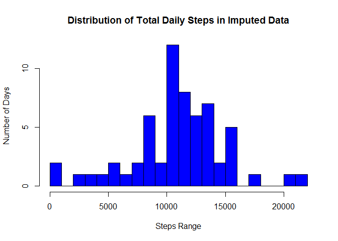

# Reproducible Research: Peer Assessment 1


## Loading and preprocessing the data
This document produces an HTML report for the first peer review project of the May-June, 2015 edition of Coursera reproducible research course.

We will first set up the directories, libraries, a simple constant, and the data.  During these firrst few steps, We will show the executed R code but skip R messages.  We will also creat ea local copy of the data so we do not have to download the file repeatedly.


```r
rm(list=ls());require("sqldf");set.seed(1);setwd("c:\\users\\public\\proj1\\")

if (file.exists("./LocalCopyOfData.csv")) {
   dataset <- read.table("./LocalCopyOfData.csv")
} else {
  fileurl <- "http://d396qusza40orc.cloudfront.net/repdata/data/activity.zip"
  temp <- tempfile()
  download.file(fileurl, temp)
  dataset <- read.table(unz(temp, "activity.csv"), sep=",",skip=0, header=TRUE)
  unlink(temp)
  write.table(dataset, "./LocalCopyOfData.csv")
}

toplines <- 3

mypretty = function (x) {sprintf("%6.1f", x)}

#interval to 24 hr clock
HHMM = function (x) {
  sprintf("%d:%d HRS", floor(x/100), x %% 100)
}

#distance between two rows for hot-deck imputation
distance = function(tbl, i, j) {
  if ((i == j) | is.na(tbl[j,1])) {
    10000;
  } else {
    dist = abs(floor(tbl[i,3]/100) * 60 + tbl[i,3] %% 100 -
              floor(tbl[j,3]/100) * 60 + tbl[j,3] %% 100);
    if (tbl[i,2] != tbl[j,2]) {
      dist = dist + 120;
    }
    dist
  }
}

#the input to this function must be an string of the type
#YYYY-MM-DD and must be a valid date.
is.weekend = function(yyyy_mm_dd) {
    day <- weekdays(as.Date(yyyy_mm_dd)) 
    if ((day == "Saturday") || (day == "Saturday")) {
      "Weekend"
    } else {
      "Weekday"
    }
}
```

To be sure that the data is loaded correctly, we will show its top 3 lines and display its dimensions:


```r
head(dataset, toplines)
```

```
##   steps       date interval
## 1    NA 2012-10-01        0
## 2    NA 2012-10-01        5
## 3    NA 2012-10-01       10
```

```r
dim(dataset)
```

```
## [1] 17568     3
```
## What is mean total number of steps taken per day?

This question is easily answered as  follows:


```r
dailyTotalSteps <- sqldf("select date, sum(steps) from dataset group by date")
```

```
## Loading required package: tcltk
```

```r
names(dailyTotalSteps) <- c("date", "TotSteps")
head(dailyTotalSteps, toplines)
```

```
##         date TotSteps
## 1 2012-10-01     <NA>
## 2 2012-10-02      126
## 3 2012-10-03    11352
```

```r
avgSteps <- mypretty(sqldf("select avg(TotSteps) from dailyTotalSteps"))
```

The average number of daily total steps is: 10766.2.  In this part of analysis we have ignored the 'na' values in the data as was allowed by the problem statement.


**Histogram of daily steps**


```r
hist(as.numeric(dailyTotalSteps$TotSteps), col="purple", breaks=25,
          xlab="Step Range", ylab="Number of Days", 
          main = "Distribution of Total Daily Steps", yaxp=c(0,10,2))
```

 

**Mean and median of daily total steps**

Continuing to ignore the missing values we find the mean and median of daily total steps to be 10766.2 and 10765.0 respectively.


## What is the average daily activity pattern?


The following r code computes the needed values:


```r
avgStepsByInterval = sqldf("select interval, avg(steps) as avg from dataset group by interval order by interval")
maxavg = max(avgStepsByInterval[2])
result <- subset(avgStepsByInterval, avg==maxavg)
```

**Time-series plot of average steps (averaged over all days)**

The time series plot is given below: 


```r
myts = ts(avgStepsByInterval$avg)
minnumber <- floor(avgStepsByInterval$interval/100) * 60 + dataset$interval %% 100
plot.ts(avgStepsByInterval$interval, myts, type="l",
        xlab="Interval",
        ylab="Average number of steps",
        main="Time Series of Average Steps vs the Minute of the Day")
```

 


**Which 5-minute interval, on average, across all days in the data set, contains the maximum number of steps?**


To find the 5-minute intervals with maximmum number of steps we first found the maximum value and then subsetted the data.  This was done because more than one 5-minute interval could have the maximum value.
It turns out that interval 835 (i.e. 8:35 HRS) has the highest number of average steps  206.2 (rounded to the first decimal point).


## Imputing missing values

We first calculate the missing values in each column of the data.


```r
reportNAcount = function(dataset, col) {
    cmd=sprintf("nrow(subset(%s, is.na(%s$%s)))", dataset, dataset, col);cmd
}
```


Using the above function we find that 0,
2304, and 
0 rows in columns interval, steps, and date respectively are NAs.

**Replacement of the missing value** 

A very good discussion of missing value imputation is available [here](http://www.stat.columbia.edu/~gelman/arm/missing.pdf "Columbia Reference"). We used the hot-deck imputation method described in the article.  For each row with a missing value in a data-set, the hot-deck method finds another row in the data set which is closest to this row but does not have the value missing.  It uses a random subset of all rows to find a closer neighbor. It then replaces the missing value by the corresponding value in the closest neighbor.
We defined a distance funtion between any two rows of the data set.  


```r
original <- dataset
if (file.exists("./ImputedData.csv")) {
   imputed <- read.table("./ImputedData.csv")
} else {
  imputed   <- dataset #will be modified
  default = sqldf("select avg(steps) from dataset"); ind=0
  for (i in 1:nrow(imputed)) {
    if(is.na(imputed[i,1])) {
      dist = 10000; ind = 1; imputed[i,1]=default;
      for (j in 1:nrow(imputed)) {
      if (runif(1) < .001) {
        thisdist = distance(original, i, j)
        if (dist > thisdist) {
        dist = thisdist;
        ind = j;
        imputed[i,1] = original[j,1]
       }
      }
    }
   }
  }
  write.table(imputed, "./ImputedData.csv")
}
NAinImputed <- eval(parse(text=reportNAcount("imputed", "steps")))
```
We verified that the imputed dataset has 0 na rows (variable NAinImputed).

**Histogram with Imputed Data**

The histogram of daily steps with imputed data is as follows:


```r
dailyTotalSteps1 <- sqldf("select date, sum(steps) from imputed group by date")
names(dailyTotalSteps1) <- c("date", "TotSteps")
head(dailyTotalSteps1, toplines)
```

```
##         date TotSteps
## 1 2012-10-01     8883
## 2 2012-10-02      126
## 3 2012-10-03    11352
```

```r
hist(as.numeric(dailyTotalSteps1$TotSteps), col="blue", breaks=25,
          xlab="Step Range", ylab="Number of Days", 
          main = "Distribution of Total Daily Steps in Imputed Data", yaxp=c(0,10,2))
```

 


**Mean and median of daily total steps in Inputed data**

We find the mean and median of daily total steps in imputed data is 10750.0 and 10765.0 respectively.

Here is a table to summarize the mean and median values with and without imputing:

| Data Characteristic        | Mean           | Median  |
| ------------- |:-------------:| -----:|
| Without Imputing      | 10766.2 | 10765.0 |
| With Hot-deck imputing     | 10750.0      |   10765.0 |

As expected, the mean and median values change as a result of imputation.


## Are there differences in activity patterns between weekdays and weekends?

The following code plots the lattice package to display the average steps per interval on weekdays and weekend.


```r
library(lattice)
imputed <- cbind(imputed, sapply(imputed$date, FUN=function(x) {is.weekend(x)}))
names(imputed)[4] <- "Weekend"

avgStepsByIntervalPanel = sqldf("select interval as intervalP, avg(steps) as avgP, Weekend as WeekendP from imputed group by interval, Weekend order by interval")
dim(avgStepsByIntervalPanel)
```

```
## [1] 576   3
```

```r
avgStepsByIntervalPanel <- cbind(avgStepsByIntervalPanel, 
    	floor(avgStepsByIntervalPanel$interval/100) * 60 + 
			avgStepsByIntervalPanel$interval %% 100)


names(avgStepsByIntervalPanel)[4] = "minnumberP"
attach(avgStepsByIntervalPanel)
xyplot(avgP~avgStepsByIntervalPanel$interval|WeekendP,
        main="Average Steps per Interval on Weekends and Weekdays", 
        ylab="Steps per Interval", 
        xlab="5 Min Interval",type="l",
  layout=c(1,2))
```

 
 
 Charts in the panel indicate that there is a difference in the patterns beetween weekdays and weekends.  The weekend activity patern is more spreadout throughout the day while weekday patterns have pockets of concentrated activities.
